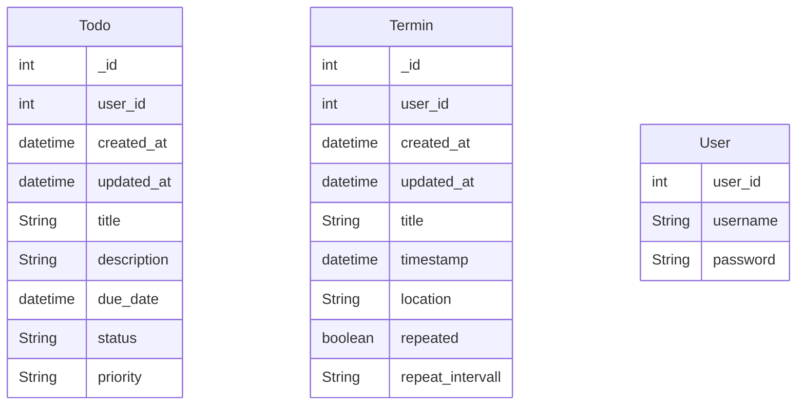
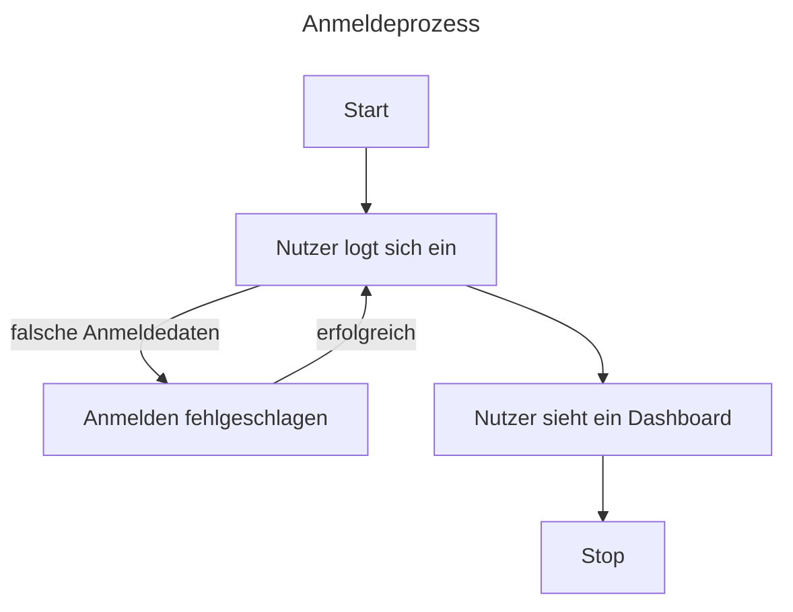

# todofse

```mermaid
erDiagram
    Todo{
        int _id
        int user_id
        datetime created_at
        datetime updated_at
        String title
        String description
        datetime due_date
        String status
        String priority
    }
    
    Termin{
        int _id
        int user_id
        datetime created_at
        datetime updated_at
        String title
        datetime timestamp
        String location
        boolean repeated
        String repeat_intervall
    }
    
    User{
        int user_id
        String username
        String password
    }
```

```mermaid
---
title: Anmeldeprozess
---
flowchart TD
    Start
    Stop
    Login[Nutzer logt sich ein]
    Failed_login[Anmelden fehlgeschlagen]
    Dashboard[Nutzer sieht ein Dashboard]
    
    Start --> Login
    Login --> Dashboard
    Login -->|falsche Anmeldedaten| Failed_login
    Failed_login -->|erfolgreich| Login
    Dashboard --> Stop
```