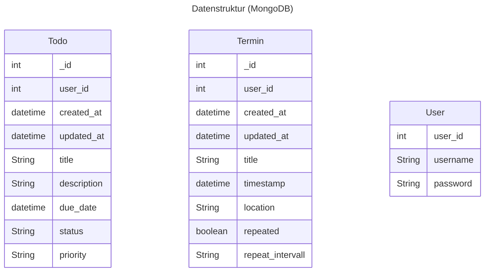
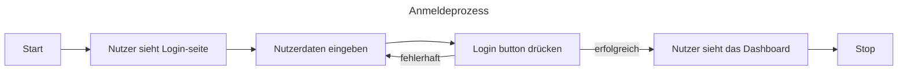
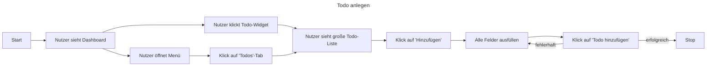
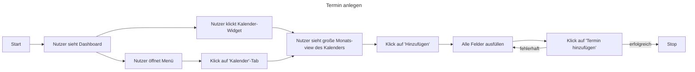

# todofse

## UI Prototyp
https://www.figma.com/design/MzwpbR6DFNJvDRwkuvOCxV/To-do-Liste?node-id=1-2&t=SizUd1L2nwv1Hl1U-0

## Backend-Repository
https://github.com/LLf13/todofse-backend

## Architektur

